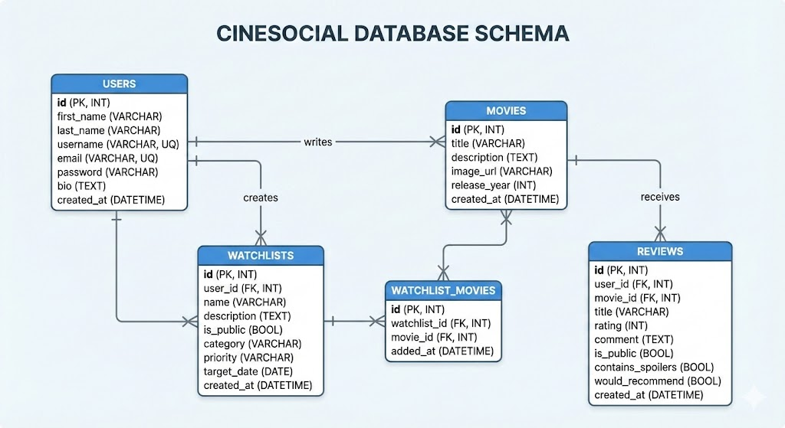

# Diseño de Base de Datos - Cinesocial

## Descripción General
El sistema utiliza una base de datos relacional MySQL llamada `cinesocial`. El diseño consta de 5 tablas interconectadas para gestionar usuarios, películas, reseñas y listas de seguimiento.

## Descripción de Tablas

### 1. `users` (Usuarios)
Almacena la información de registro y perfil de los usuarios.
- **id**: Identificador único (Primary Key, Auto-increment).
- **first_name**: Nombre real del usuario.
- **last_name**: Apellido del usuario.
- **username**: Nombre de usuario único para login.
- **email**: Correo electrónico único.
- **password**: Contraseña (en texto plano para este ejercicio académico).
- **bio**: Breve biografía del usuario.
- **created_at**: Fecha de registro.

### 2. `movies` (Películas)
Catálogo central de películas disponibles en la plataforma.
- **id**: Identificador único.
- **title**: Título de la película.
- **description**: Sinopsis completa.
- **image_url**: URL http de la imagen del póster.
- **release_year**: Año de estreno.
- **created_at**: Fecha de alta en el sistema.

### 3. `reviews` (Reseñas)
Opiniones y calificaciones creadas por los usuarios.
- **id**: Identificador único.
- **user_id**: Referencia al autor (Foreign Key -> users).
- **movie_id**: Referencia a la película (Foreign Key -> movies).
- **title**: Título corto de la reseña.
- **rating**: Calificación numérica (1-5).
- **comment**: Texto completo de la opinión.
- **is_public**: Visibilidad (1=Pública, 0=Privada).
- **contains_spoilers**: Bandera de spoilers.
- **would_recommend**: Bandera de recomendación.
- **created_at**: Fecha de publicación.

### 4. `watchlists` (Listas de Seguimiento)
Colecciones personalizadas de películas.
- **id**: Identificador único.
- **user_id**: Dueño de la lista (Foreign Key -> users).
- **name**: Nombre de la lista.
- **description**: Descripción del propósito de la lista.
- **is_public**: Visibilidad.
- **category**: Categoría (Acción, Drama, General, etc.).
- **priority**: Nivel de prioridad (Alta, Media, Baja).
- **target_date**: Fecha meta para terminar la lista.
- **created_at**: Fecha de creación.

### 5. `watchlist_movies` (Pivote Películas-Listas)
Tabla intermedia para la relación muchos-a-muchos entre Listas y Películas.
- **id**: Identificador único.
- **watchlist_id**: Referencia a la lista (Foreign Key -> watchlists).
- **movie_id**: Referencia a la película (Foreign Key -> movies).
- **added_at**: Fecha en que se agregó a la lista.
- **Constraint Unique**: Evita duplicados de la misma película en la misma lista.
